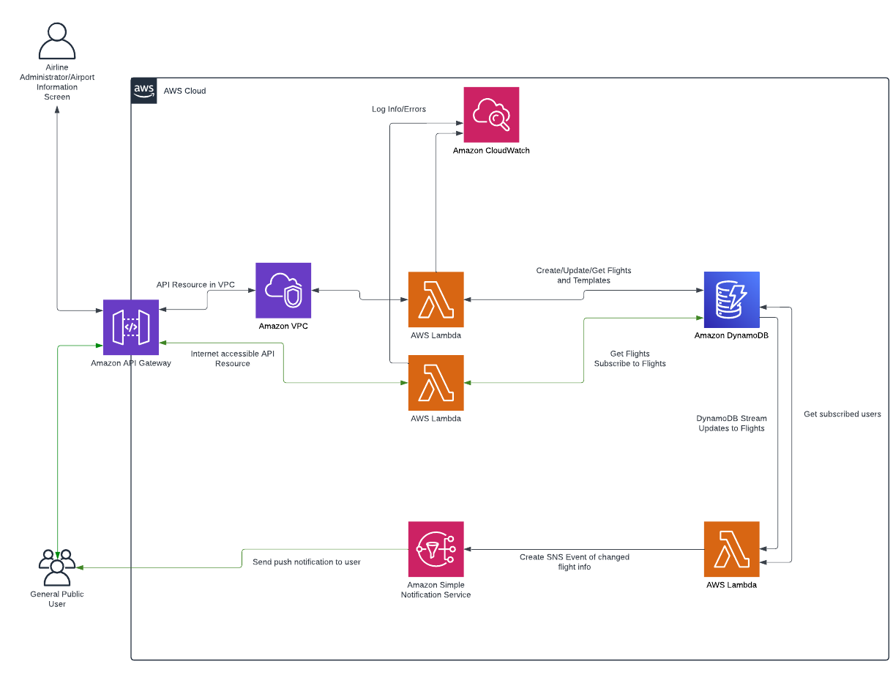
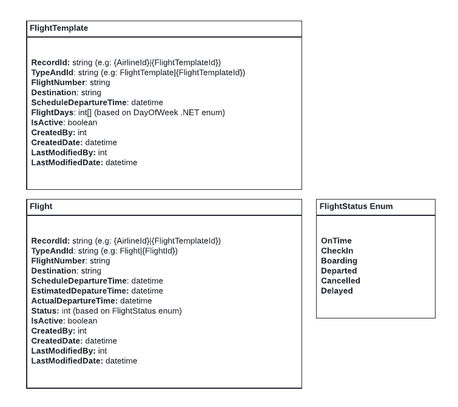
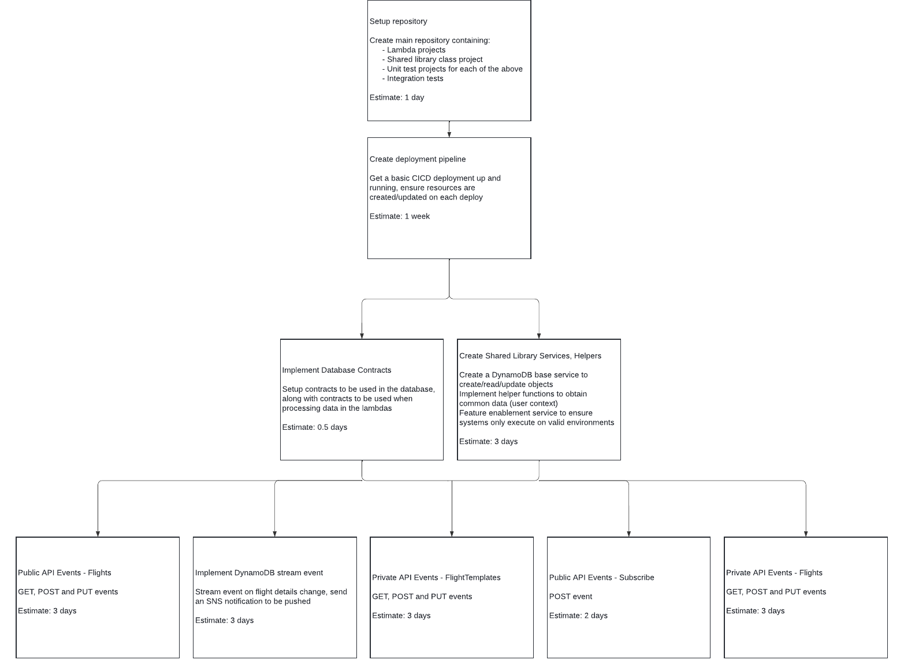

# Flight Information Display System

This design implementation is to outline updating, viewing and subscribing to flight departure information for an airport.

## Context

An airport has a departure flight information screen, which consists of a flight schedule. This flight schedule needs to be able to be updated by employee users for their airline. The public is also able to view this information online, and subscribe to flight changes.

## Acceptance Criteria
1. Flight templates:
    1. Get flight template(s);
        1. Airline employee user must be able to get flight templates for their airline. The user can only see their own airline's flight templates.
    2. Creating a flight template:
        1. Airline employee user must be able to create a flight template (example, NZ0128 to Melbourne (MEL) at 6:30am on Monday, Wednesday, Friday)
        2. On creation, flights will be generated for 12 months in advance, allowing public users to subscribe to a specific flight ahead of time.
        3. This user can only create a flight template for the airline they are an employee of.
    3. Updating a flight template:
        1. Airline employee user must be able to update a flight template.
        2. On update, future flights will be updated to reflect the new schedule from the effective date.
        3. This user can only update a flight template for the airline they are an employee of.
    4. Making a flight template inactive:
        1. Airline employee user must be able to make a flight template inactive.
        2. On update, future flights will be made inactive from the effective date.
        3. This user can only make a flight template inactive for the airline they are an employee of.
2. Flights
    1. Getting flight(s):
         1. Airline employee user must be able to get flights for their airline. The user can only see their own airline's flights.
         2. The flight information display board must also be able to get a list of flights from all airlines.
         3. A public user must also be able to get a list of flights from all airlines.  
    2. Updating a flight:
        1. Airline employee user must be able to update a flight (example, Flight NZ0128 to Melbourne (MEL) has changed status to boarding, at 6:00am).
        3. This user can only update a flight for the airline they are an employee of.
        2. On update, the flight changes will be sent to public users which have subscribed to the flight.
    3. Subscribing to flight(s) changes:
        1.  A public user can subscribe to a flight, which adds them to a subscribed user list.
        2. When a flight's status or details change, a push notification is sent out to the user.

## Architecture
A series of AWS services will be used to implement the system, involving an API Gateway, Lambdas to handle the private and public service calls, DynamoDB to handle storage of data, Cloudwatch for logging and SNS to send push notifications.

A high level overview can be seen below:

### Reasoning for decision on Cloud Services chosen
- DynamoDB: Compared to an equivalent relational database, such as Aurora, DynamoDB offers cheaper storage options, and is scalable according to the needs of the system, when spikes in usage occur.
- API gateway: Have a single gateway endpoint, with a resource for private and public use, to be able to easily proxy requests to the appropriate AWS Lambdas.
- AWS Lambda: Code executed on demand where you are only charged based on time, memory usage and amount of requests. Lambdas also have the ability to scale horizontally.
- Amazon VPC: Leverage a virtual network and only have it accessible through means of a VPN, allowing only airline employee users to be able to access certain areas of the flight information system (creating/updating).
- Amazon SNS: A notification queue designed to ingest messages and send out push notifications through a number of means.
- CloudWatch: To be able to log lambda info or errors, and set alarms for the other AWS services in use (when a system goes down, memory usage, execution time, Dynamo read/write count warnings).
- Github Actions: leverage the CICD systems from Github to execute actions involving building and testing the .NET code, and deploying the cloud services required.

### Code and Deployment
The lambdas will be implemented in .NET 8 (Current LTS release) and deployed using Github Actions, leveraging the AWS CLI to create/update the resources required.

In order to facilitate easier testing and separation, multiple environments will be created:
- Dev (for developers to deploy to and test in a cloud environment)
- QA (for developers and QA to be able to test their merged changes)
- Stage (environment for early access users to be able to use and test out, as close to production as possible)
- Production (the live system)

Tests would be run in Dev, QA and Stage to ensure each set of merged changes work as expected.

In order to stagger deployment and ensure only the correct environments can access the APIs at the right times, the system would be put behind a feature enablement switch. Communication with customers and dates for User Acceptance Testing, and final release would be set. The process would be for example like:
    - Feature enabled in development straight away
    - Once E2E testing can be achieved, the feature can be enabled for QA environment
    - On UAT release, enable the feature for Stage
    - On final release, enable the feature for Production

### Testing
To cover the lambdas and their respective services to access and update flight information and send push notifications, a suite of unit tests will be created to cover these areas.

To ensure changes do not break on deployments and to assist with regression testing, end to end testing will be done for each deployment, covering the API calls.

## Entity Definition
Below are the definitions for how the DynamoDB implementation would be setup.

## API Definitions
An API Definition for both the private and public resources are shown below:

### Private Admin API:
- `/admin`
    - `/flightTemplates`
        - GET `/{flightTemplateId}`
        - GET  
        - POST 
        - PUT
    -  `/flights`
        - GET `/{flightId}`
        - GET
        - PUT 
### Public API:
- `/public`
    - `/flights`
        - GET `/{flightId}`
        - GET
    - `/subscribe`
        - POST

## Project Plan

Team size for work required: 2
- There may be times required where team members need to liaiase with other domain teams (DevOps for example, on setting up a CICD pipeline), which may require work from these outside team members.
- To ensure other team members aren't sitting idle, have this feature work sit alongside other work in a sprint/kanban board.

## Assumptions
- The Flight Information Display System would be a small piece in the wider part of systems in play, and with respect to employee and public users, there would be a system in place for user management.
    - There is also the assumption in place that there is a user context, with the authentication and authorization, which can be passed to the API gateway and onto the lambdas.
- With respect to updating flights or a flight template, the changes should be audited either through DynamoDB, putting the entire object as an audit, or leveraging CloudTrail and S3 to store logged changes to objects.
- The Amazon SNS push notification assumes that the public user has an application to receive these notifications on, as I have made what sort of notification it is quite ambiguous. 
- The specification does not explicitly say about unsubscribing, but in the interest of the user, there should be an unsubscribe option available.

